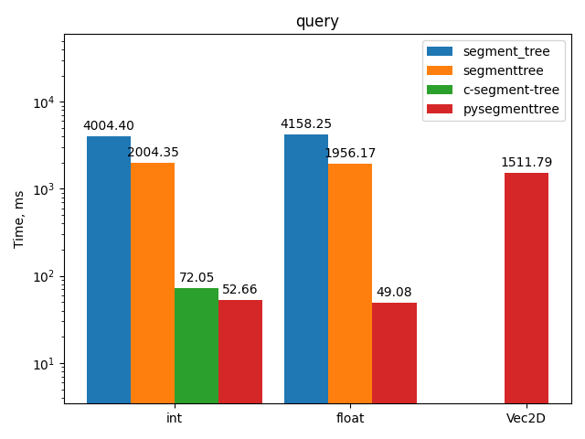

# pysegmenttree
[](https://github.com/greshilov/pysegmenttree/blob/master/LICENSE)
[](https://github.com/greshilov/pysegmenttree/actions/workflows/ci.yaml)
[](https://codecov.io/gh/greshilov/pysegmenttree)

Segment tree is a data structure to perform efficient range queries over an array.

Properties of the segment tree with the size N.

| Operation | Time complexity |
| --------------- | --------------- |
| build | O(N) |
| query | O(Log[N]) |
| update | O(Log[N]) |

# Key features
* Implements classical data structure to deal with interval queries.
* Includes two classes **IntSegmentTree** and **FloatSegmentTree** implemented in pure C. They can boost performance up to 20x and are used by default for simple data types if possible.

# Installation
```
$ pip install pysegmenttree
```

# Basic usage
```
>> from pysegmenttree import stree

# Build the tree
# 'sum' function is used by default
>> tree = stree([5, 1, 9, 4, 5, 11])

# Find sum on the interval [1, 4)
>> tree.query(1, 4)
14

# Set element with index 3 to 6
>> tree.update(3, 6)
>> tree.query(1, 4)
16
```

# Advanced usage
There are three predefined query functions available that can be used with `int` or `float` trees. Use them as follows:
```
>> from pysegmenttree import stree, QueryFunction
>> tree = stree([5, 1, 9, 4, 5, 11], func=QueryFunction.MIN)

# Find min on the interval [1, 4)
>> tree.query(1, 4)
1
```

Plain python functions are also suitable, but in this case c-extensions will **not** be used.
```
>> tree = stree([5, 1, 9, 4, 5, 11], func=min)
>> tree.query(1, 4)
1
```

Example with user-defined class.
```
>> from pysegmenttree import stree
>> from pysegmenttree.test_utils import Vec2D
# List of 2D vectors
>> tree = stree([Vec2D(0, 1), Vec2D(5, -2), Vec2D(-2, 3)], func=max)
# Find the vector of maximum length on the interval [0, 2)
>> tree.query(0, 2)

Vec2D(x=5, y=-2)
```

# Docs
Docs are available [here](https://pysegmenttree.readthedocs.io/en/latest/).

# Perfomance

Three basic segment tree operations were benchmarked for three different types `int`, `float` and `Vec2D`.
I included results for 3 other python segment trees libraries for comparison.
All code related to benchmarking can be found in `benchmarks` subdirectory.

* [segment-tree](https://github.com/evgeth/segment_tree)
* [segmenttree](https://github.com/1e0ng/segmenttree)
* [c-segment-tree](https://github.com/gilaniasher/segtree-c-python)

## init
| Param | Value |
| --------- | ------- |
| Tree size | 100 000 |


[](benchmarks/with_other_libs/data/init.png "init")

## query
| Param | Value |
| --------- | ------- |
| Tree size | 100 000 |
| Queries performed | 10 000 |

[](benchmarks/with_other_libs/data/query.png "query")

## update
| Param | Value |
| --------- | ------- |
| Tree size | 100 000 |
| Updates performed | 10 000 |

[](benchmarks/with_other_libs/data/update.png "update")


# Development
Read more [here](DEVELOPMENT.md).
